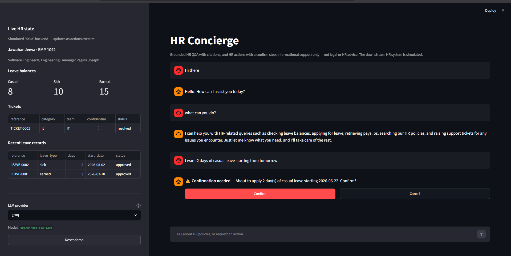
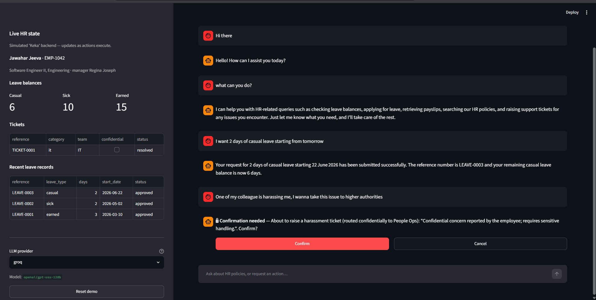
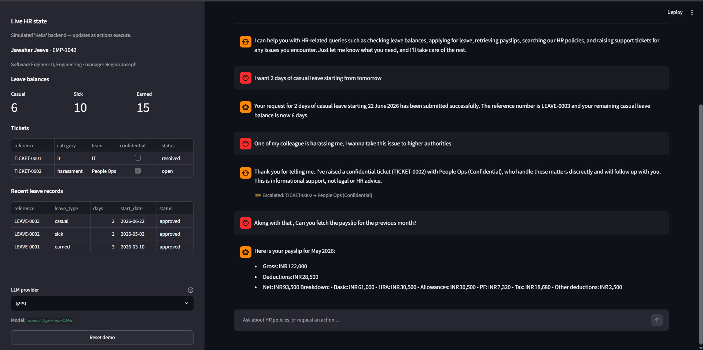
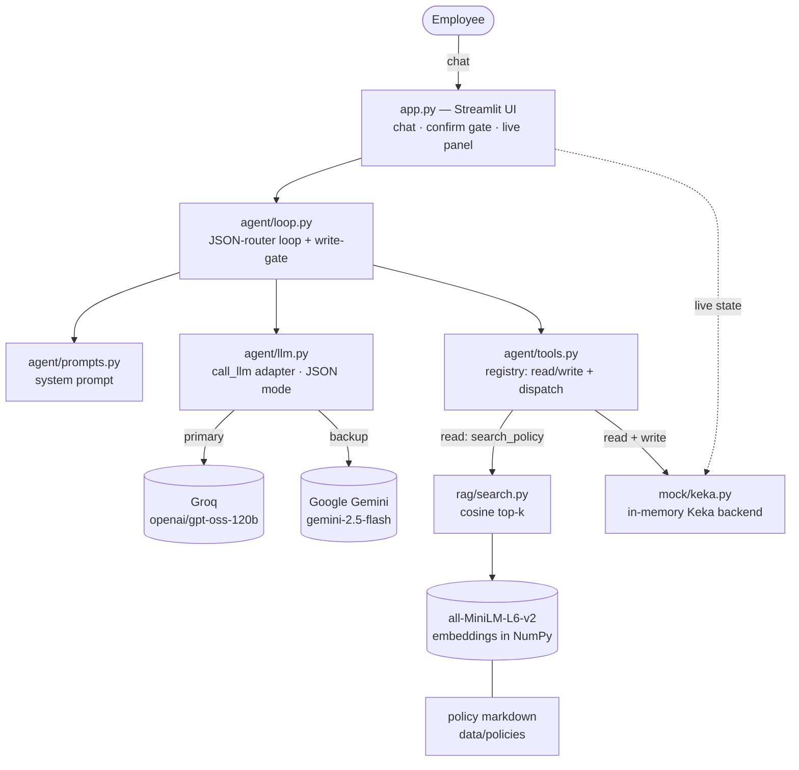
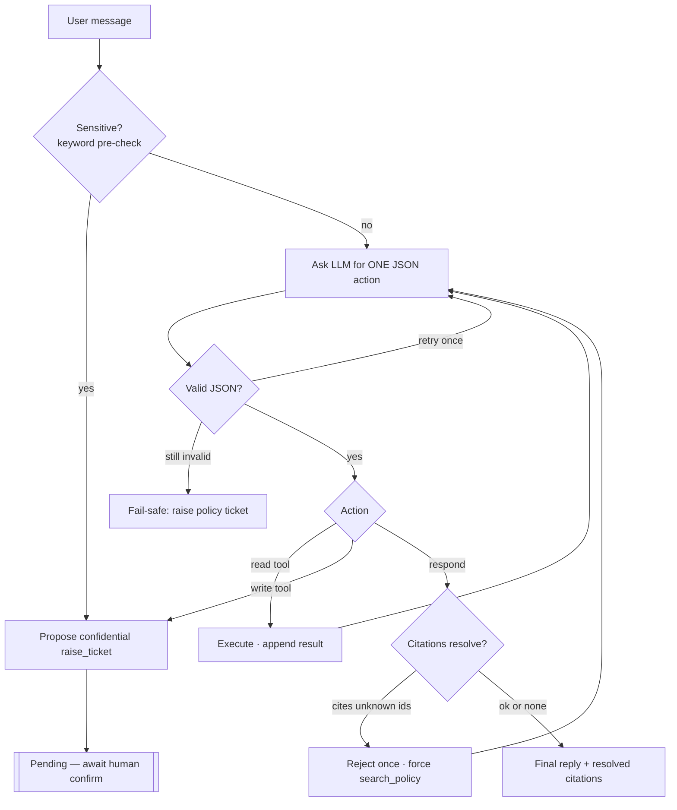
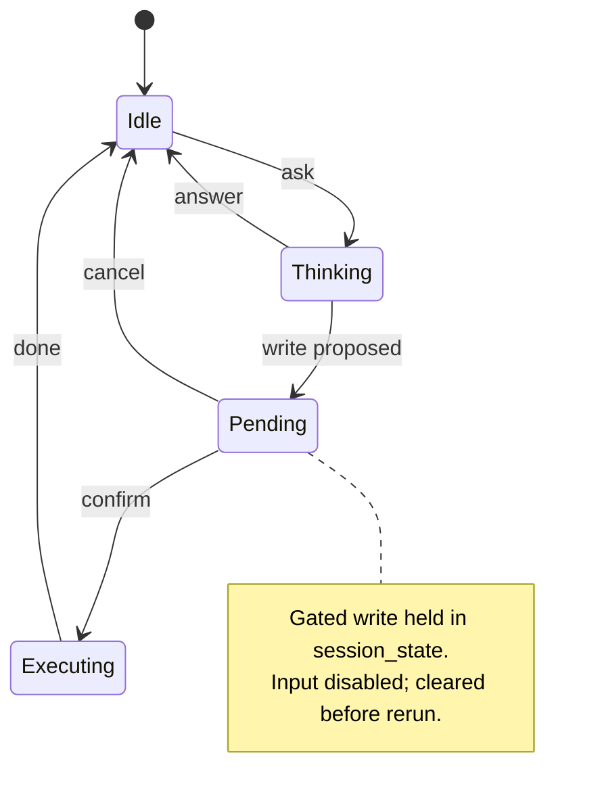
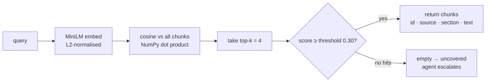
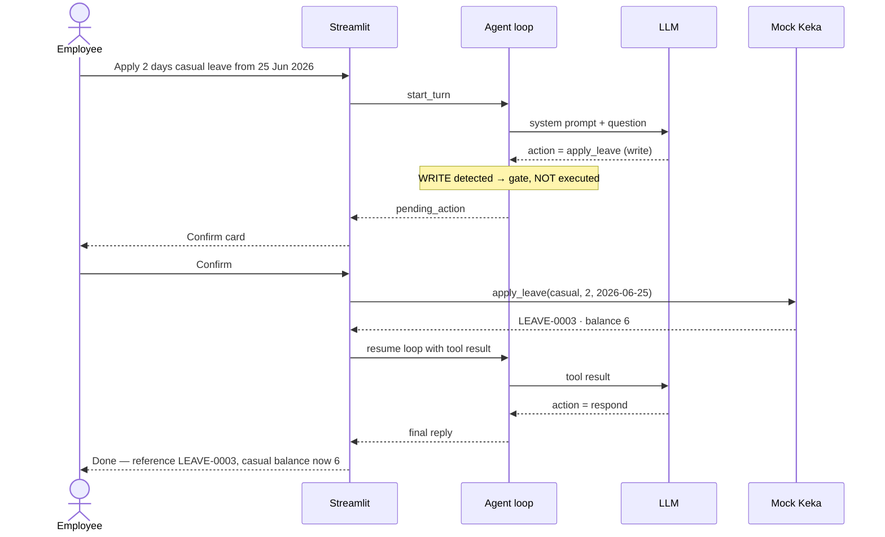

# HR Concierge — an agentic HR helpdesk assistant

A take-home demo built for **Connect and Heal**. HR Concierge is a grounded,
tool-using HR helpdesk assistant. It answers employee questions **only** from a
small set of HR policy documents (with citations), and it can take actions on the
employee's behalf — checking a leave balance, applying for leave, raising a
ticket, fetching a payslip — through tools, with a **human-in-the-loop
confirmation before any state-changing action**.

> **The agent's reasoning and tool-selection are real. The downstream HR system
> ("Keka") is simulated** — an in-memory mock, not a real integration. Output is
> informational support only, not legal or HR advice.

It runs entirely on **free LLM tiers** (Groq or Google Gemini), uses **local
embeddings** for retrieval (no vector database), and hand-rolls both the
retrieval and the agent loop (no LangChain / LlamaIndex).

---

## Table of contents

1. [What it does](#what-it-does)
2. [Demo moments](#demo-moments-exact-prompts)
3. [Screenshots](#screenshots)
4. [Architecture](#architecture)
4. [The agent loop](#the-agent-loop)
5. [The human-in-the-loop write-gate](#the-human-in-the-loop-write-gate)
6. [Grounded retrieval (RAG)](#grounded-retrieval-rag)
7. [The mock "Keka" backend](#the-mock-keka-backend)
8. [Conversation memory](#conversation-memory)
9. [Safety design](#safety-design)
10. [End-to-end example (sequence)](#end-to-end-example-apply-leave)
11. [Repository layout](#repository-layout)
12. [Configuration](#configuration)
13. [Setup & run](#setup--run)
14. [Testing](#testing)
15. [Tech choices and why](#tech-choices-and-why)
16. [Limitations](#limitations)
17. [Licence](#licence)

---

## What it does

- **Grounded Q&A** — answers HR questions only from the policy docs and cites the
  source document and section. It never uses outside knowledge for policy
  answers; if the docs don't cover a question, it escalates instead of guessing.
- **Actions via tools** — check leave balance, apply for leave, raise a ticket,
  fetch a payslip, all against the mock "Keka" backend.
- **Human-in-the-loop** — any state-changing (write) action must be confirmed by
  the employee before it executes.
- **Escalation** — sensitive topics (harassment, discrimination, anything legal
  or medical-personal, pay disputes) and questions the docs don't cover are
  **not** answered; the agent raises a routed ticket instead.
- **Live side panel** — leave balances, tickets and recent leave records update
  the instant an action executes.

---

## Demo moments (exact prompts)

| # | Type | Type this | What happens |
|---|------|-----------|--------------|
| 1 | Grounded Q&A | `How many casual leave days do I get?` | Searches the policy docs, answers with a citation to *Leave & PTO → Leave Types and Annual Entitlement*. |
| 2 | Action + confirm | `Apply 2 days casual leave from 25 Jun 2026` | Proposes a write → **confirm card** → on Confirm the casual balance drops 8→6 and a `LEAVE-000n` reference appears in the panel. |
| 3 | Sensitive → escalate | `I think my manager is harassing me` | No policy answer; raises a **confidential** ticket routed to **People Ops**, shown in the panel. |
| 4 | Read action | `Show my latest payslip` | Fetches the latest payslip from the mock and summarises it. |

Follow-ups work too, e.g. after #4 ask `do you have payslips for before that month?`

---

## Screenshots

Live run against Groq (`openai/gpt-oss-120b`). Note the **live "Keka" state panel**
on the left and the **confirm step** before any write.

**1 — Chat, live state panel, and the human-in-the-loop confirm card.** The agent
has proposed applying 2 days' casual leave (it resolved "tomorrow" to `2026-06-22`)
and is waiting for **Confirm / Cancel** — the write has **not** executed yet, so the
casual balance is still **8**.



**2 — Write executed, then a sensitive message escalates.** After confirming, the
leave is applied — casual balance drops **8 → 6** and `LEAVE-0003` appears in
*Recent leave records*. A "a colleague is harassing me" message is **not** answered;
the agent proposes a **confidential** ticket routed to **People Ops**, again behind a
confirm step.



**3 — Confidential ticket raised, and a payslip fetched.** `TICKET-0002 → People Ops
(Confidential)` now shows in the *Tickets* panel, and a follow-up payslip request is
fulfilled with a full breakdown — all in one continuing conversation.



---

## Architecture

A single Streamlit process. The UI drives a hand-rolled agent loop; the loop talks
to one model-agnostic `call_llm()` adapter, a tool registry, and a local retrieval
index. The "Keka" backend is an in-memory object held in session state.



**Key idea: a model-agnostic JSON router, not native function calling.** Both
backends are asked to return **one JSON action per turn** in JSON mode. Provider
and model come from `.env`, so switching backends is a one-line change. Doing the
dispatch ourselves is also what lets us enforce the safety-critical write-gate in
code rather than trusting a provider's tool-calling semantics.

The action the model must emit each turn:

```json
{ "action": "<tool name or 'respond'>", "args": { }, "confirm": false }
```

`respond` ends the turn with `args: {"text": "...", "citation_ids": ["..."]}`.

---

## The agent loop



Rules enforced by the loop (`agent/loop.py`):

- **Reads chain freely.** `search_policy`, `check_leave`, `get_payslip` execute
  immediately; their result is appended and the loop continues.
- **Writes are gated.** The moment a write (`apply_leave`, `raise_ticket`) is
  proposed, the loop stops and returns it as a `pending` action — it is **not**
  executed. The gate is decided from the tool registry's `kind`, never from the
  model's `confirm` field (that is only a phrasing hint).
- **Iteration cap (~6).** If exceeded, the loop escalates rather than spinning.
- **JSON robustness.** A malformed reply is retried once; if it still fails, the
  turn degrades to a fail-safe ticket so the app never crashes.
- **Grounding guard.** If the model emits `respond` citing ids that no
  `search_policy` result returned (i.e. it invented a citation or answered from
  memory), the loop rejects it once and forces a real search.
- **Backend errors.** A rate limit / network / auth failure tells the user to
  retry and does **not** raise an HR ticket (a 429 is not something to page HR
  about). The fail-safe ticket is reserved for genuine agent failures.

---

## The human-in-the-loop write-gate

Streamlit reruns the whole script top-to-bottom, so the gate is modelled as a
session-state machine. All state mutations happen inside event handlers (a chat
submission, or a Confirm/Cancel click), each of which ends with `st.rerun()`; the
"draw" portion runs every pass and always reflects the latest state.



*Read-only answers return straight to Idle; a proposed write parks in Pending
(gated, not executed) until the employee confirms or cancels.*

On **Confirm**: the tool executes, the result is appended, `pending_action` is
cleared *before* the rerun, and the loop resumes to produce the final message
(e.g. "Done — reference LEAVE-0007, casual balance now 6"). On **Cancel**: a
"cancelled" result is fed back and the agent acknowledges; nothing mutates.

---

## Grounded retrieval (RAG)

`search_policy` is a **read tool**. Policy markdown is chunked by section once at
startup and embedded with a local `sentence-transformers` model. A query is
embedded the same way and scored against every chunk by cosine similarity — a
single NumPy matrix-vector product, since the vectors are L2-normalised. No vector
database.



The agent answers **only** from returned chunks and cites their ids; citations are
rendered from chunk metadata, never from free text the model writes. The
threshold cleanly separates on-topic from off-topic (measured: relevant queries
score 0.5–0.8, unrelated ones ≤ 0.15), so an unsupported question returns nothing
and is escalated rather than answered.

---

## The mock "Keka" backend

An in-memory object (`mock/keka.py`) held in Streamlit session state. Seeded
deterministically for the demo:

- **Employee:** Jawahar Jeeva (EMP-1042), Engineering, manager Regina Joseph.
- **Balances:** casual 8, sick 10, earned 15.
- **History:** a couple of past leave records, one resolved IT ticket, three
  monthly payslips.

Design rules:

- **The mock mints every reference id** (`LEAVE-000n`, `TICKET-000n`). The agent
  only relays ids the mock returns — it can never fabricate one.
- **`apply_leave` validates first** (known leave type, whole number of days ≥ 1,
  valid non-past date, sufficient balance) and returns a structured error the
  agent reads back; it never overdraws or mutates on invalid input.
- **`raise_ticket` routes the category to a team in code**, so the model cannot
  choose where a sensitive ticket goes:

| Category | Routed to | Confidential |
|----------|-----------|:---:|
| harassment / discrimination / misconduct | People Ops | ✔ |
| payroll / salary / reimbursement | Finance | |
| it / access / hardware | IT | |
| policy / leave / benefits / general | HR Generalist | |

Sensitive keywords found anywhere in the category **or** summary force confidential
People Ops routing, so a sensitive ticket can never be downgraded.

---

## Conversation memory

Follow-ups like *"what about earned leave?"* or *"payslips before that month?"*
need context, but threading prior turns into a small free model measurably
degrades its tool-calling (it starts answering from context instead of calling
`search_policy` / `get_payslip`). So memory is **follow-up-aware**: recent
*questions* (not prior answers) are threaded in **only** when the new message
looks referential — a cue like "that", "those", "what about", or a very short
utterance. Self-contained questions stay context-free and reliable.

---

## Safety design

- **Writes gated in code** — the dispatcher decides read-vs-write from the
  registry, so the model cannot self-authorise a state change.
- **ID integrity** — only the mock mints `LEAVE-`/`TICKET-` ids; the agent relays
  them.
- **Citation integrity** — citations resolve against retrieved chunk metadata;
  invented ids are dropped, and a reply that cites only invented ids is rejected
  and re-grounded.
- **Escalation over guessing** — sensitive matters and uncovered questions raise a
  routed ticket instead of a policy-style answer (a keyword pre-check plus the
  system prompt drive this).
- **Fail-safe, never crash** — bad model output, a tool error, or the iteration
  cap degrade to a ticket; backend/rate-limit errors degrade to a retry message
  with no ticket.

---

## End-to-end example: apply leave



---

## Repository layout

```
Agentic-HR-Concierge/
├─ app.py                     # Streamlit UI: chat, confirm-gate state machine, side panel
├─ config.py                  # env-driven config (provider/model/threshold/top_k) with defaults
├─ conftest.py                # puts repo root on sys.path for tests
├─ requirements.txt
├─ .env.example               # copy to .env and fill in keys
├─ .streamlit/config.toml     # disables the dev file-watcher (see Limitations)
├─ agent/
│  ├─ llm.py                  # call_llm(): Groq + Gemini behind one adapter, JSON mode
│  ├─ tools.py                # tool registry (read/write) + dispatch + write-gate helpers
│  ├─ prompts.py              # system prompt construction
│  ├─ loop.py                 # JSON-router agent loop, write-gate, escalation, grounding guard
│  ├─ fake_llm.py             # deterministic scripted LLM for tests & the CLI self-test
│  └─ cli.py                  # CLI harness: interactive REPL + keyless --selftest
├─ mock/
│  └─ keka.py                 # in-memory state, 4 operations, ID generation, validation, routing
├─ rag/
│  ├─ ingest.py               # load + chunk policy docs by section
│  └─ search.py               # build index + cosine top-k retrieval (search_policy)
├─ data/policies/             # 5 sectioned HR policy docs (Leave, Benefits, Conduct, Expense, Remote)
└─ tests/
   ├─ test_keka.py            # mock layer
   ├─ test_loop.py            # agent loop, write-gate, escalation, grounding guard, fallbacks
   ├─ test_rag.py             # chunking + real-embedding retrieval + grounded citation
   └─ test_app.py             # Streamlit UI via AppTest (all four demo moments + memory)
```

---

## Configuration

All settings are read from environment variables (loaded from `.env` via
python-dotenv) with sensible defaults — no secrets in code.

| Variable | Default | Purpose |
|----------|---------|---------|
| `LLM_PROVIDER` | `groq` | Which backend `call_llm()` uses: `groq` or `gemini`. |
| `GROQ_API_KEY` | — | Groq key (free at console.groq.com). |
| `GROQ_MODEL` | `openai/gpt-oss-120b` | Groq model (tool-use + JSON mode). |
| `GEMINI_API_KEY` | — | Gemini key (free at aistudio.google.com). |
| `GEMINI_MODEL` | `gemini-2.5-flash` | Gemini model. |
| `RETRIEVAL_TOP_K` | `4` | Chunks returned per search. |
| `RETRIEVAL_THRESHOLD` | `0.30` | Minimum cosine similarity to count as relevant. |
| `EMBED_MODEL` | `all-MiniLM-L6-v2` | Local embedding model. |
| `MAX_AGENT_ITERATIONS` | `6` | Loop cap per turn. |
| `LLM_TEMPERATURE` | `0.0` | Keeps the JSON router deterministic. |

---

## Setup & run

Requires **Python 3.10+** and a free API key from **Groq** and/or **Google AI
Studio**.

```bash
# 1. Virtual environment
python -m venv .venv
# Windows (PowerShell):
.venv\Scripts\Activate.ps1
# macOS / Linux:
source .venv/bin/activate

# 2. Dependencies
pip install -r requirements.txt

# 3. Keys
cp .env.example .env        # then edit .env
#   set LLM_PROVIDER=groq  and  GROQ_API_KEY=...
#   (or LLM_PROVIDER=gemini and GEMINI_API_KEY=...)

# 4. Run the app
streamlit run app.py
```

Opens at http://localhost:8501. The first run downloads the `all-MiniLM-L6-v2`
model (~90 MB) once. You can also switch provider live from the sidebar.

> On Windows, if `Activate.ps1` is blocked by the execution policy, call the venv
> Python directly, e.g. `.venv\Scripts\python.exe -m streamlit run app.py`.

---

## Testing

```bash
# Full automated suite — 73 tests, no API key or network needed
python -m pytest -q

# Keyless agent-loop demo: prints every emitted JSON action and shows the
# write-gate, the sensitive escalation, and the JSON-failure fallback
python -m agent.cli --selftest

# Interactive CLI against the configured live model (needs a key in .env)
python -m agent.cli
```

The **73 tests** span four areas and run without any API key (a scripted fake LLM
stands in, and the RAG tests use the real local embedding model):

- **`test_keka.py`** — seeding, the four operations, ID generation, every
  validation path (and that none mutate on failure), and category→team routing.
- **`test_loop.py`** — reads chaining, the write-gate (including that it ignores
  the model's `confirm` field), confirm/cancel, the sensitivity pre-check, the
  grounding guard, citation integrity, and the never-crash fallbacks
  (bad JSON → retry → escalate; iteration cap; backend error → retry, no ticket).
- **`test_rag.py`** — section chunking and real-embedding retrieval (relevant
  query hits the right section above threshold; off-topic returns nothing;
  grounded citation resolves end-to-end).
- **`test_app.py`** — the Streamlit app via the official `AppTest` harness: all
  four demo moments end-to-end (grounded citation, gated apply-leave, confidential
  escalation, payslip read), Cancel, and follow-up memory.

---

## Tech choices and why

- **Model-agnostic JSON router (not native function calling).** Keeps the agent
  portable across providers/free tiers — the same prompt and parser work for Groq
  and Gemini, and switching is one config line. Doing the dispatch ourselves is
  also what lets us enforce the write-gate in code.
- **Local embeddings, no vector DB.** With a handful of short docs, brute-force
  cosine over NumPy is exact, instant, and needs zero infrastructure;
  `sentence-transformers` runs locally and free.
- **No LangChain / LlamaIndex.** Retrieval and the agent loop are hand-rolled so
  the control flow — especially the write-gate and escalation — is explicit and
  auditable.
- **Mocked downstream.** The brief is to demonstrate safe agentic reasoning; a
  real HR integration is out of scope, so "Keka" is an in-memory simulation.

---

## Limitations

- The HR backend is simulated and in-memory; state resets when the app restarts.
- Policy answers are only as good as the sample docs in `data/policies/` — they
  are illustrative, not Connect and Heal's real policies.
- A small free model behind a hand-rolled JSON router is occasionally imperfect at
  tool selection. The code-side guards (write-gate, ID and citation integrity,
  search-before-answer) keep it **safe and grounded** regardless, and
  follow-up-aware memory keeps self-contained questions reliable.
- The Streamlit dev file-watcher is disabled (`.streamlit/config.toml`): it walks
  `transformers`' optional vision modules, which try to import `torchvision` (not
  installed) and spam the logs. Trade-off: edit code → restart to reload.
- This is a demo for informational support — not a system of record, and not
  legal or HR advice.

---

## Licence

MIT — see [LICENSE](LICENSE).
